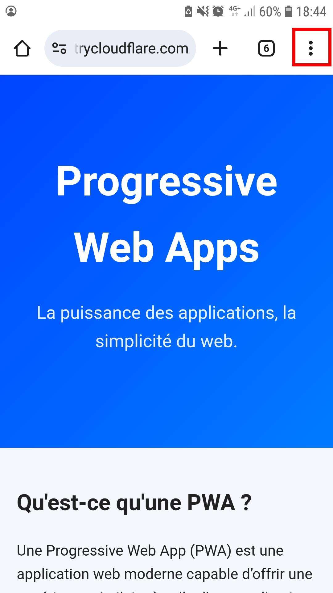
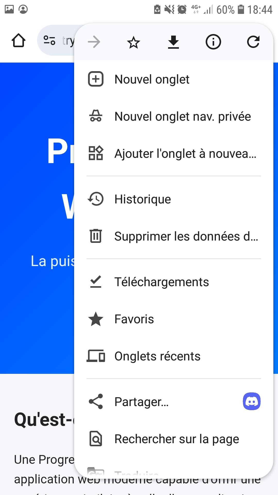
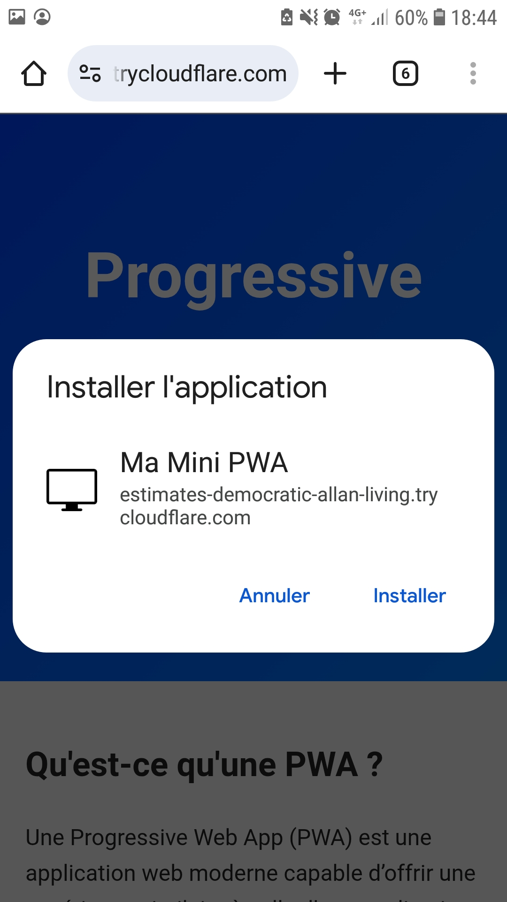
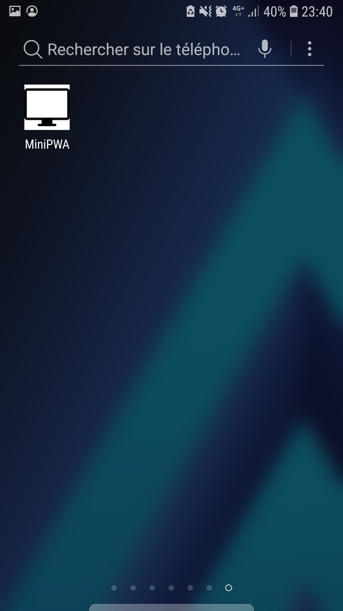

# PWA
Créer une PWA à partir d'un site web en local

## Pré-requis
Clone le repo :
```
git clone git@github.com:milletarthur/PWA.git
```

Télécharger Cloudflared
```
wget https://github.com/cloudflare/cloudflared/releases/latest/download/cloudflared-linux-amd64.deb

sudo dpkg -i cloudflared-linux-amd64.deb
```
## Instructions

### 1. Lancer le serveur local
Ouvrir un terminal et dans le répertoire racine du projet (**PWA**) puis exécuter :
```
npx serve .
```

### 2. Créer un tunnel avec Cloudflared
Ouvrir un autre terminal et dans le répertoire racine du projet (**PWA**) puis exécuter :
```
cloudflared tunnel --url http://localhost:3000
```

### 3. Ouvrir sur votre appareil mobile l'URL générée



### 4. Ouvrir le menu en haut à droite dans votre navigateur



### 5. Sélectionner "Ajouter à l'écran d'accueil"


### 5. Sélectionner "Installer"



### 6. Ouvrir l'application mobile


